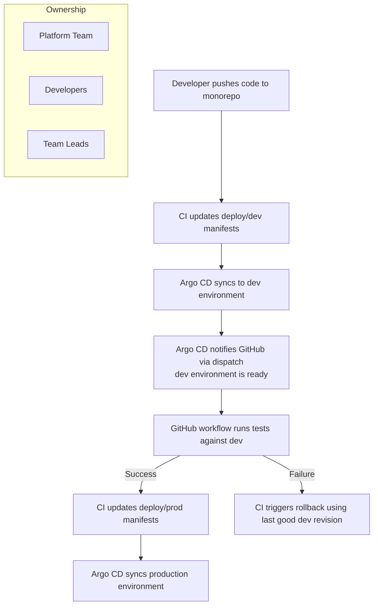
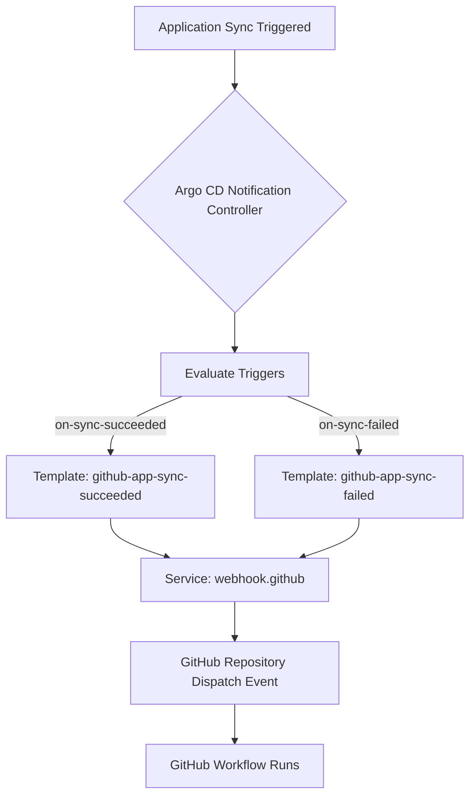
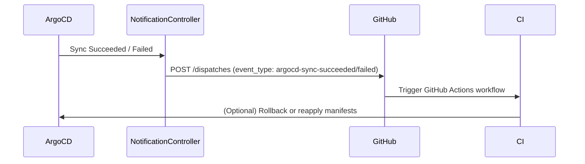

# Coffee cup
<!-- TOC start (generated with https://github.com/derlin/bitdowntoc) -->

- [GitOps and Monorepo Structure](#gitops-and-monorepo-structure)
  - [Repository Layout Overview](#repository-layout-overview)
  - [GitOps Structure Explanation](#gitops-structure-explanation)
    - [Ownership Summary](#ownership-summary)
    - [GitOps Flow Diagram](#gitops-flow-diagram)
- [Monorepo Application Structure](#monorepo-application-structure)
  - [Example Layout](#example-layout)
  - [Folder Roles](#folder-roles)
- [Argo CD User Accounts, Roles, Projects, and Permissions](#argo-cd-user-accounts-roles-projects-and-permissions)
- [Platform and Developer Autonomy](#platform-and-developer-autonomy)
- [Application onboarding and App of Apps pattern](#application-onboarding-and-app-of-apps-pattern)
- [Rollback and Notifications Integration](#rollback-and-notifications-integration)
- [How notifications work?](#how-notifications-work)
  - [Rollback Workflow](#rollback-workflow)
  - [Notifications Overview](#notifications-overview)
    - [Notification Flow](#notification-flow)
    - [Example Triggers and Templates](#example-triggers-and-templates)
    - [Example Notification setup](#example-notification-setup)
    - [Example GitHub Workflow Triggered](#example-github-workflow-triggered)
  - [Troubleshooting notification controller](#troubleshooting-notification-controller)
- [Lab setup](#lab-setup)
- [TODO](#todo)

<!-- TOC end -->

## GitOps and Monorepo Structure

This repository implements a **GitOps workflow using Argo CD**, combining both **platform configuration** and
**application code** within a single monorepo. It enables fully automated deployment, promotion, and rollback
of applications across development and production environments.

### Repository Layout Overview

```bash
.
├── gitops/
│   ├── platform/
│   │   ├── apps/
│   │   ├── projects/
│   │   └── manifests/
│   └── products/
│       ├── dev/
│       └── prod/
└── products/
    └── coffee-cup/
        ├── src/
        └── deploy/
```

### GitOps Structure Explanation

- **`gitops/platform/`**

  - Contains Argo CD **Applications**, **Projects**, and **shared platform services** such as ingress,
    metrics, etc.
  - Owned by the **platform team**.

- **`gitops/products/`**

  - Contains Argo CD **Application manifests for all product teams**.
  - Split by environment:

    - `dev/` — managed by developers.
    - `prod/` — owned by team leads.
  - These manifests point to the deployment paths inside the `products/<app>/deploy/` folders.

#### Ownership Summary

| Folder                 | Purpose                                       | Ownership     |
| ---------------------- | --------------------------------------------- | ------------- |
| `gitops/platform`      | Core Argo CD apps, projects, and shared infra | Platform Team |
| `gitops/products/dev`  | Argo CD apps for development                  | Developers    |
| `gitops/products/prod` | Argo CD apps for production                   | Team Leads    |

#### GitOps Flow Diagram



---

## Monorepo Application Structure

All application code and deployment manifests live in this same repository.
This ensures that **code, infrastructure definitions, and promotion pipelines** are versioned together.

### Example Layout

```bash
products/
└── coffee-cup/
    ├── src/
    │   ├── app.py
    │   ├── Dockerfile
    │   └── requirements.txt
    │
    └── deploy/
        ├── dev/
        │   ├── deploy.yaml
        │   └── service.yaml
        │
        └── prod/
            ├── deploy.yaml
            └── service.yaml
```

### Folder Roles

| Folder             | Description                                              | Ownership  |
| ------------------ | -------------------------------------------------------- | ---------- |
| **`src/`**         | Application code and build definition (Dockerfile).      | Shared     |
| **`deploy/dev/`**  | Dev manifests, automatically applied via Argo CD.        | Developers |
| **`deploy/prod/`** | Prod manifests, auto-promoted after successful dev sync. | Team Leads |

---

## Argo CD User Accounts, Roles, Projects, and Permissions

**Users & Roles**

| User        | Role      | Description                                                                                                    | Password     |
| ----------- | --------- | -------------------------------------------------------------------------------------------------------------- | ------------ |
| `admin`     | Admin     | Full superuser access to Argo CD.                                                                              | `coffeeCup1` |
| `platform`  | Platform  | Full access to Argo CD itself, clusters, repos, and all projects. Can manage settings and accounts.            | `coffeeCup1` |
| `developer` | Developer | Full access to the `dev` project. Read-only access to the `prod` project. Can deploy and manage apps in `dev`. | `coffeeCup1` |
| `team_lead` | Team Lead | Full access to both `dev` and `prod` projects. Can manage apps, sync, create, delete, and exec/port-forward.   | `coffeeCup1` |

---

**Projects**

| Project    | Description                            | Accessible by                    |
| ---------- | -------------------------------------- | -------------------------------- |
| `platform` | Platform-level apps and infrastructure | Platform only                    |
| `dev`      | Development applications               | Developer, Team Lead             |
| `prod`     | Production applications                | Team Lead, Developer (read-only) |

---

**Permissions Summary**

- **Platform Role**

  - Manage Argo CD, clusters, repos, projects, accounts, settings.
  - View all applications.
  - Exec / port-forward on any cluster.

- **Developer Role**

  - Full access to `dev` project apps (create, sync, delete).
  - Read-only access to `prod` project apps.
  - Exec / port-forward in `dev` namespace.

- **Team Lead Role**

  - Full access to `dev` and `prod` project apps (create, sync, delete).
  - Exec / port-forward in `dev` and `prod`.
  - Read-only access to clusters globally.

---

## Platform and Developer Autonomy

In Argo CD, **projects** define boundaries for applications, including which repositories, clusters,
and namespaces they can operate in. In our setup, we have three main projects:

- **platform** – manages core services and manifests in the `platform` folder; owned by the Platform Team.
- **dev** – manages applications in `products/dev` folder; owned by Developers.
- **prod** – manages applications in `products/prod` folder; owned by Team Leads.

Using projects together with namespace-scoped applications and self-service notifications allows each
team to operate independently:

- **Platform Team** can manage shared platform manifests and core services.
- **Developers** can update their dev environment applications and trigger automated tests.
- **Team Leads** can promote and manage production deployments without affecting dev workflows.

**How it works:**

- Applications are assigned to the proper project (`platform`, `dev`, or `prod`).
- `--application-namespaces` ensures Argo CD watches all relevant namespaces.
- `--self-service-notification-enabled` allows teams to act on notifications, such as triggering
  workflows or monitoring deployments, without requiring admin intervention.

This combination of **projects**, **namespaces**, and **self-service notifications** ensures a clear
separation of responsibilities while maintaining a fully automated GitOps workflow.

## Application onboarding and App of Apps pattern

- **Developers’ apps location**:
  All developer applications are stored in the repository under:

```bash
gitops/products/apps
├── dev
│   └── <app-name>.yaml
└── prod
    └── <app-name>.yaml
```

- **Adding new applications**:
  Developers are **code owners** of this folder, so they can create or update application manifests
  directly in `dev` and `prod`. Each file represents an Argo CD **child application** with its
  environment-specific settings.

- **App of Apps pattern**:

  - The **top-level App of Apps** is a single Argo CD application that points to a folder containing
    other application manifests.
  - One App of Apps exists for `dev`, watching `gitops/products/apps/dev`.
  - Another exists for `prod`, watching `gitops/products/apps/prod`.
  - When a new child app is added or updated, the App of Apps automatically deploys or updates it in
    the cluster.

- **Benefits**:

  - Developers can onboard apps without direct access to the cluster.
  - Admins control the overall structure, namespace, and sync policies.
  - Separation of concerns: developers focus on code; admins manage infrastructure and projects.

---

**Example child application (coffee-cup app for dev)**

```yaml
apiVersion: argoproj.io/v1alpha1
kind: Application
metadata:
  name: coffee-cup-dev
  namespace: argocd
spec:
  project: dev
  source:
    repoURL: 'https://github.com/labotomy-dot-dev/coffee-cup.git'
    targetRevision: main
    path: products/coffee-cup/deploy/dev
  destination:
    server: 'https://kubernetes.default.svc'
    namespace: dev
  syncPolicy:
    automated:
      prune: true
      selfHeal: true
    syncOptions:
      - CreateNamespace=true
```

**Example App of Apps for dev**

Notice that parent app lives in `argocd` namespace and project is `platform`.

```yaml
apiVersion: argoproj.io/v1alpha1
kind: Application
metadata:
  name: dev-apps-products
  namespace: argocd
spec:
  project: platform
  source:
    repoURL: 'https://github.com/labotomy-dot-dev/coffee-cup.git'
    targetRevision: main
    path: gitops/products/apps/dev
  destination:
    server: 'https://kubernetes.default.svc'
    namespace: argocd
  syncPolicy:
    automated:
      prune: true
      selfHeal: true
```

---

**How it works (workflow)**

1. Developer creates or updates their app YAML in `gitops/products/apps/dev`.
2. The **dev App of Apps** detects the new/updated app and deploys it to the dev namespace.
3. Argo CD notifications or CI/CD workflows run tests against the dev deployment.
4. Once tests succeed, the **prod App of Apps** picks up the app YAML in `gitops/products/apps/prod`
   and deploys it automatically to prod.

This ensures **self-service onboarding** for developers while keeping environments safe and controlled
by admins.

## Rollback and Notifications Integration

The deployment pipeline integrates **Argo CD Notifications** and **automated rollback** to ensure stability
and traceability throughout the GitOps process.

## How notifications work?



**Explanation of the flow:**

1. **Application Sync Triggered** – A deployment is applied or reconciled in Argo CD.
2. **Notification Controller** – Monitors the application status.
3. **Evaluate Triggers** – Checks conditions like `on-sync-succeeded` or `on-sync-failed`.
4. **Templates** – Predefined templates determine the payload and which service to send notifications to.
5. **Webhook Service** – Sends the notification to GitHub using the configured `service.webhook.github`.
6. **GitHub Repository Dispatch Event** – Triggers a GitHub Actions workflow in your repository.
7. **GitHub Workflow Runs** – Executes subsequent steps like tests, promotion, or deployments.

- [Git Webhook Configuration](https://argo-cd.readthedocs.io/en/stable/operator-manual/webhook/)

### Rollback Workflow

1. Each Argo CD application uses automated sync with `selfHeal` and `prune` enabled.
2. If deployment to the `dev` or `prod` environment fails (due to manifest error, image issue, etc.):

   - Argo CD detects the failed sync.
   - A rollback is triggered automatically to the **last healthy revision**.
3. The failed event is reported through the **notifications subsystem** (GitHub webhook or Slack).

### Notifications Overview

Argo CD Notifications is configured to send **repository_dispatch** events to GitHub on key triggers.

#### Notification Flow



#### Example Triggers and Templates

- **Trigger:** `on-sync-succeeded`

  - Fires when app sync succeeds.
  - Sends `argocd-sync-succeeded` GitHub dispatch event.

- **Trigger:** `on-sync-failed`

  - Fires when sync fails.
  - Sends `argocd-sync-failed` dispatch event and logs rollback.

#### Example Notification setup

```yaml
## Notifications controller
notifications:
  enabled: true
  # you'll have to create secret manually
  secret:
    create: false
  argocdUrl: "https://argocd.labotomy.dev"

  # # 1. Define the webhook service
  notifiers:
    service.webhook.github: |
      url: https://api.github.com/repos/labotomy-dot-dev/coffee-cup/dispatches
      method: POST
      headers:
        - name: Authorization
          value: Bearer $github_token
        - name: Accept
          value: application/vnd.github+json
  # 2. Define triggers
  triggers:
    trigger.on-sync-succeeded: |
      - description: Application syncing has succeeded
        send:
          - github-app-sync-succeeded
        when: app.status.operationState.phase in ['Succeeded']

    trigger.on-sync-failed: |
      - description: Application syncing has failed
        send:
          - github-app-sync-failed
        when: app.status.operationState.phase in ['Error', 'Failed']

  # 3. Define templates (reference the service by name)
  templates:
    template.github-app-sync-failed: |
      webhook:
        github:
          method: POST
          url: https://api.github.com/repos/labotomy-dot-dev/coffee-cup/dispatches
          headers:
            Authorization: Bearer $github_token
            Accept: application/vnd.github+json
          body: |
            {
              "event_type": "argocd-sync-failed",
              "client_payload": {
                "app": "{{.app.metadata.name}}",
                "project": "{{.app.spec.project}}",
                "revision": "{{.app.status.sync.revision}}"
              }
            }
    template.github-app-sync-succeeded: |
      webhook:
        github:
          method: POST
          url: https://api.github.com/repos/labotomy-dot-dev/coffee-cup/dispatches
          headers:
            Authorization: Bearer $github_token
            Accept: application/vnd.github+json
          body: |
            {
              "event_type": "argocd-sync-succeeded",
              "client_payload": {
                "app": "{{.app.metadata.name}}",
                "project": "{{.app.spec.project}}",
                "revision": "{{.app.status.sync.revision}}"
              }
            }
  # 4. Define subscriptions
  subscriptions:
    - recipients:
      - github
      triggers:
        - on-sync-succeeded
        - on-sync-failed
```

#### Example GitHub Workflow Triggered

When Argo CD sends a `repository_dispatch`:

```yaml
on:
  repository_dispatch:
    types: [argocd-sync-failed, argocd-sync-succeeded]

jobs:
  handle_event:
    runs-on: ubuntu-latest
    steps:
      - name: Checkout repo
        uses: actions/checkout@v4

      - name: Rollback if sync failed
        if: ${{ github.event.action == 'argocd-sync-failed' }}
        run: |
          echo "Rollback triggered for ${{ github.event.client_payload.app }}"
          ./scripts/rollback_cli_.sh
```

### Troubleshooting notification controller

Argo CD Notification Controller job is to:

1. Watch **Argo CD Application CRs**.
2. Evaluate **triggers** when an Application’s status changes.
3. Execute **templates** and send messages via **services** (e.g., Slack, GitHub, webhook, etc.).

The configuration is driven by **ConfigMap** and **Secret** resources:

- `argocd-notifications-cm` → defines triggers, templates, subscriptions, and services
- `argocd-notifications-secret` → stores credentials or tokens used in templates

What fields are available to send notifications? Run this:

```bash
kubectl -n argocd get application coffee-cup-dev -o yaml
```

Everything you see in that YAML is accessible in the template under `.app.<field path>`.

If you want to experiment with template syntax safely, you can use the Argo CD CLI with local rendering:

```bash
argocd login argocd.labotomy.dev --grpc-we
argocd app get coffee-cup-dev -o json > tmp/app.json
# now you can check for fields
jq -r '.status.operationState.phase' tmp/app.json\n
jq -r '.status.summary.images[0]' tmp/app.json\n
jq -r '.metadata.name' tmp/app.json\n
```

Here's the mapping you want to use in triggers & templates

```text
.metadata.name  ->  .app.metadata.name
.spec.project   ->  .app.spec.project
.status.summary.images[0] -> .app.status.summary.images[0]
.status.operationState.phase -> app.status.operationState.phase
```

To run argocd-notifications commands manually inside the container to test templates, triggers, etc.
run argocd notification controller pod in a job and execute into it:

```bash
# extract you argocd notification controller image name and version
kubectl -n argocd get deploy argocd-notifications-controller \
  -o jsonpath='{.spec.template.spec.containers[0].image}{"\n"}'
# change the job in helpers/debug-job.yaml image if it's different 
kubectl apply -f helpers/debug-job.yaml
kubectl -n argocd exec -it job/debug-notifications -- bash
```

You may want to try using [gomplate](https://github.com/hairyhenderson/gomplate) as well.

## Lab setup

**Requirements:**

- docker
- kind
- kubectl
- helm
- Taskfile

Install devbox to install all lab tools expect for docker or install all of them any other way. Here's
the setup for devbox:

```bash
curl -fsSL https://get.jetify.com/devbox | bash
```

And install packages:

```bash
devbox install
```

Finally run shell:

```bash
devbox shell
```

Run full lab:

```bash
task lab.up
```

Use Taskfile other commands to manage ArgoCD and other acpects of the lab.

## TODO

- [ ] Configure [application in any namespace](https://argo-cd.readthedocs.io/en/stable/operator-manual/app-any-namespace/)
- [ ] Configure [Resource tracking](https://argo-cd.readthedocs.io/en/stable/user-guide/resource_tracking/)
- [ ] Configure [Namespace based configuration for notifications](https://argo-cd.readthedocs.io/en/stable/operator-manual/notifications/#namespace-based-configuration)
  - [ ] Configure Github workflow to react on notifications per app
