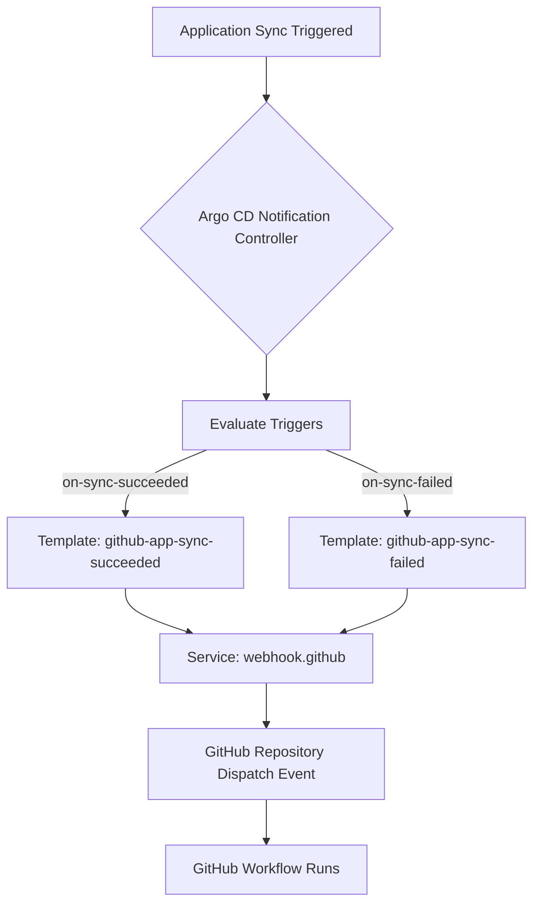

# Coffee cup
<!-- TOC start (generated with https://github.com/derlin/bitdowntoc) -->

- [Lab info](#lab-info)
- [Lab setup](#lab-setup)
- [Lab up](#lab-up)
- [Argo CD User Accounts, Roles, Projects, and Permissions](#argo-cd-user-accounts-roles-projects-and-permissions)

<!-- TOC end -->

## Lab info

Just my playground for argocd.

**Requirements:**

- docker
- kind
- kubectl
- helm
- Taskfile

## Lab setup

Install devbox to install all lab tools expect for docker or install all of them any other way. Here's
the setup for devbox:

```bash
curl -fsSL https://get.jetify.com/devbox | bash
```

And install packages:

```bash
devbox install
```

Finally run shell:

```bash
devbox shell
```

## Lab up

Run full lab:

```bash
task lab.up
```

Use Taskfile other commands to manage ArgoCD.

## Argo CD User Accounts, Roles, Projects, and Permissions

**Users & Roles**

| User        | Role      | Description                                                                                                    | Password     |
| ----------- | --------- | -------------------------------------------------------------------------------------------------------------- | ------------ |
| `admin`     | Admin     | Full superuser access to Argo CD.                                                                              | `coffeeCup1` |
| `platform`  | Platform  | Full access to Argo CD itself, clusters, repos, and all projects. Can manage settings and accounts.            | `coffeeCup1` |
| `developer` | Developer | Full access to the `dev` project. Read-only access to the `prod` project. Can deploy and manage apps in `dev`. | `coffeeCup1` |
| `team_lead` | Team Lead | Full access to both `dev` and `prod` projects. Can manage apps, sync, create, delete, and exec/port-forward.   | `coffeeCup1` |

---

**Projects**

| Project    | Description                            | Accessible by                    |
| ---------- | -------------------------------------- | -------------------------------- |
| `platform` | Platform-level apps and infrastructure | Platform only                    |
| `dev`      | Development applications               | Developer, Team Lead             |
| `prod`     | Production applications                | Team Lead, Developer (read-only) |

---

**Permissions Summary**

- **Platform Role**

  - Manage Argo CD, clusters, repos, projects, accounts, settings.
  - View all applications.
  - Exec / port-forward on any cluster.

- **Developer Role**

  - Full access to `dev` project apps (create, sync, delete).
  - Read-only access to `prod` project apps.
  - Exec / port-forward in `dev` namespace.

- **Team Lead Role**

  - Full access to `dev` and `prod` project apps (create, sync, delete).
  - Exec / port-forward in `dev` and `prod`.
  - Read-only access to clusters globally.

---

## Notifications

- [Git Webhook Configuration](https://argo-cd.readthedocs.io/en/stable/operator-manual/webhook/)



**Explanation of the flow:**

1. **Application Sync Triggered** – A deployment is applied or reconciled in Argo CD.
2. **Notification Controller** – Monitors the application status.
3. **Evaluate Triggers** – Checks conditions like `on-sync-succeeded` or `on-sync-failed`.
4. **Templates** – Predefined templates determine the payload and which service to send notifications to.
5. **Webhook Service** – Sends the notification to GitHub using the configured `service.webhook.github`.
6. **GitHub Repository Dispatch Event** – Triggers a GitHub Actions workflow in your repository.
7. **GitHub Workflow Runs** – Executes subsequent steps like tests, promotion, or deployments.
