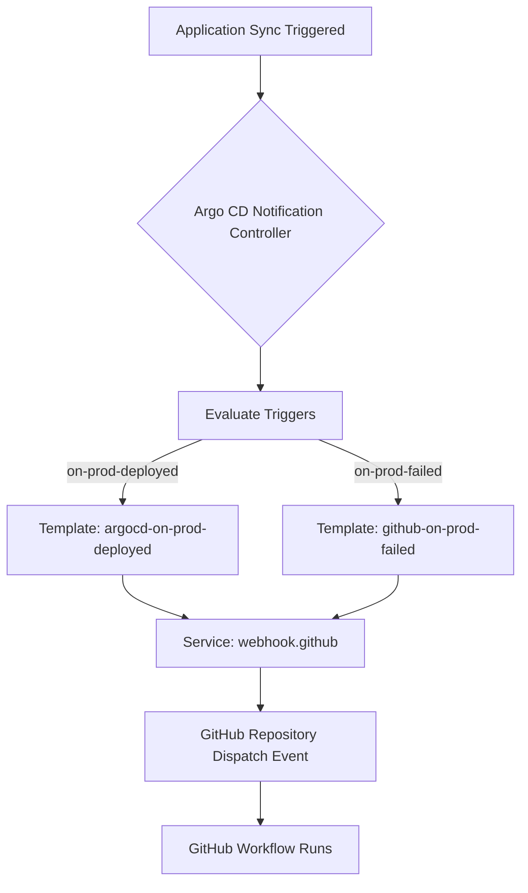
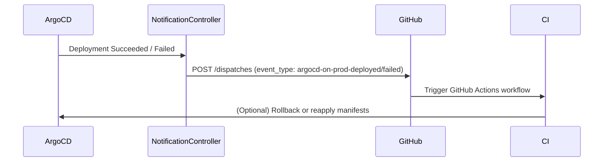

# Coffee cup
<!-- TOC start (generated with https://github.com/derlin/bitdowntoc) -->

- [GitOps and Monorepo Structure](#gitops-and-monorepo-structure)
  - [Repository Layout Overview](#repository-layout-overview)
  - [GitOps Structure Explanation](#gitops-structure-explanation)
    - [Ownership Summary](#ownership-summary)
    - [GitOps Flow Diagram](#gitops-flow-diagram)
- [Monorepo Application Structure](#monorepo-application-structure)
  - [Example Layout](#example-layout)
  - [Folder Roles](#folder-roles)
- [Argo CD User Accounts, Roles, Projects, and Permissions](#argo-cd-user-accounts-roles-projects-and-permissions)
- [Platform and Developer Autonomy](#platform-and-developer-autonomy)
- [Application onboarding and App of Apps pattern](#application-onboarding-and-app-of-apps-pattern)
- [How notifications work?](#how-notifications-work)
  - [Rollback Workflow](#rollback-workflow)
  - [Notifications Overview](#notifications-overview)
    - [Notification Flow](#notification-flow)
  - [Troubleshooting notification controller](#troubleshooting-notification-controller)
- [coffee-cup app deploy/test/rollback scenarios](#coffee-cup-app-deploytestrollback-scenarios)
  - [Promotion excercise](#promotion-excercise)
  - [Rollback excercise](#rollback-excercise)
- [Lab setup](#lab-setup)
- [TODO](#todo)

<!-- TOC end -->

## GitOps and Monorepo Structure

This repository implements a **GitOps workflow using Argo CD**, combining both **platform configuration** and
**application code** within a single monorepo. It enables fully automated deployment, promotion, and rollback
of applications across development and production environments.

### Repository Layout Overview

```bash
.
├── gitops/
│   ├── platform/
│   │   ├── apps/
│   │   ├── projects/
│   │   └── manifests/
│   └── products/
│       ├── dev/
│       └── prod/
└── products/
    └── coffee-cup/
        ├── src/
        └── deploy/
```

### GitOps Structure Explanation

- **`gitops/platform/`**

  - Contains Argo CD **Applications**, **Projects**, and **shared platform services** such as ingress,
    metrics, etc.
  - Owned by the **platform team**.

- **`gitops/products/`**

  - Contains Argo CD **Application manifests for all product teams**.
  - Split by environment:

    - `dev/` — managed by developers.
    - `prod/` — owned by team leads.
  - These manifests point to the deployment paths inside the `products/<app>/deploy/` folders.

#### Ownership Summary

| Folder                 | Purpose                                       | Ownership     |
| ---------------------- | --------------------------------------------- | ------------- |
| `gitops/platform`      | Core Argo CD apps, projects, and shared infra | Platform Team |
| `gitops/products/dev`  | Argo CD apps for development                  | Developers    |
| `gitops/products/prod` | Argo CD apps for production                   | Team Leads    |

#### GitOps Flow Diagram


---

## Monorepo Application Structure

All application code and deployment manifests live in this same repository.
This ensures that **code, infrastructure definitions, and promotion pipelines** are versioned together.

### Example Layout

```bash
products/
└── coffee-cup/
    ├── src/
    │   ├── app.py
    │   ├── Dockerfile
    │   └── requirements.txt
    │
    └── deploy/
        ├── dev/
        │   ├── deploy.yaml
        │   └── service.yaml
        │
        └── prod/
            ├── deploy.yaml
            └── service.yaml
```

### Folder Roles

| Folder             | Description                                              | Ownership  |
| ------------------ | -------------------------------------------------------- | ---------- |
| **`src/`**         | Application code and build definition (Dockerfile).      | Shared     |
| **`deploy/dev/`**  | Dev manifests, automatically applied via Argo CD.        | Developers |
| **`deploy/prod/`** | Prod manifests, auto-promoted after successful dev sync. | Team Leads |

---

## Argo CD User Accounts, Roles, Projects, and Permissions

**Users & Roles**

| User        | Role      | Description                                                                                                    | Password     |
| ----------- | --------- | -------------------------------------------------------------------------------------------------------------- | ------------ |
| `admin`     | Admin     | Full superuser access to Argo CD.                                                                              | `coffeeCup1` |
| `platform`  | Platform  | Full access to Argo CD itself, clusters, repos, and all projects. Can manage settings and accounts.            | `coffeeCup1` |
| `developer` | Developer | Full access to the `dev` project. Read-only access to the `prod` project. Can deploy and manage apps in `dev`. | `coffeeCup1` |
| `team_lead` | Team Lead | Full access to both `dev` and `prod` projects. Can manage apps, sync, create, delete, and exec/port-forward.   | `coffeeCup1` |

---

**Projects**

| Project    | Description                            | Accessible by                    |
| ---------- | -------------------------------------- | -------------------------------- |
| `platform` | Platform-level apps and infrastructure | Platform only                    |
| `dev`      | Development applications               | Developer, Team Lead             |
| `prod`     | Production applications                | Team Lead, Developer (read-only) |

---

**Permissions Summary**

- **Platform Role**

  - Manage Argo CD, clusters, repos, projects, accounts, settings.
  - View all applications.
  - Exec / port-forward on any cluster.

- **Developer Role**

  - Full access to `dev` project apps (create, sync, delete).
  - Read-only access to `prod` project apps.
  - Exec / port-forward in `dev` namespace.

- **Team Lead Role**

  - Full access to `dev` and `prod` project apps (create, sync, delete).
  - Exec / port-forward in `dev` and `prod`.
  - Read-only access to clusters globally.

---

## Platform and Developer Autonomy

In Argo CD, **projects** define boundaries for applications, including which repositories, clusters,
and namespaces they can operate in. In our setup, we have three main projects:

- **platform** – manages core services and manifests in the `platform` folder; owned by the Platform Team.
- **dev** – manages applications in `products/dev` folder; owned by Developers.
- **prod** – manages applications in `products/prod` folder; owned by Team Leads.

Using projects together with namespace-scoped applications and self-service notifications allows each
team to operate independently:

- **Platform Team** can manage shared platform manifests and core services.
- **Developers** can update their dev environment applications and trigger automated tests.
- **Team Leads** can promote and manage production deployments without affecting dev workflows.

**How it works:**

- Applications are assigned to the proper project (`platform`, `dev`, or `prod`).
- `--application-namespaces` ensures Argo CD watches all relevant namespaces.
- `--self-service-notification-enabled` allows teams to act on notifications, such as triggering
  workflows or monitoring deployments, without requiring admin intervention.

This combination of **projects**, **namespaces**, and **self-service notifications** ensures a clear
separation of responsibilities while maintaining a fully automated GitOps workflow.

## Application onboarding and App of Apps pattern

- **Developers’ apps location**:
  All developer applications are stored in the repository under:

```bash
gitops/products/apps
├── dev
│   └── <app-name>.yaml
└── prod
    └── <app-name>.yaml
```

- **Adding new applications**:
  Developers are **code owners** of this folder, so they can create or update application manifests
  directly in `dev` and `prod`. Each file represents an Argo CD **child application** with its
  environment-specific settings.

- **App of Apps pattern**:

  - The **top-level App of Apps** is a single Argo CD application that points to a folder containing
    other application manifests.
  - One App of Apps exists for `dev`, watching `gitops/products/apps/dev`.
  - Another exists for `prod`, watching `gitops/products/apps/prod`.
  - When a new child app is added or updated, the App of Apps automatically deploys or updates it in
    the cluster.

- **Benefits**:

  - Developers can onboard apps without direct access to the cluster.
  - Admins control the overall structure, namespace, and sync policies.
  - Separation of concerns: developers focus on code; admins manage infrastructure and projects.

---

**Example child application (coffee-cup app for dev)**

```yaml
apiVersion: argoproj.io/v1alpha1
kind: Application
metadata:
  name: coffee-cup-dev
  namespace: argocd
spec:
  project: dev
  source:
    repoURL: 'https://github.com/labotomy-dot-dev/coffee-cup.git'
    targetRevision: main
    path: products/coffee-cup/deploy/dev
  destination:
    server: 'https://kubernetes.default.svc'
    namespace: dev
  syncPolicy:
    automated:
      prune: true
      selfHeal: true
    syncOptions:
      - CreateNamespace=true
```

**Example App of Apps for dev**

Notice that parent app lives in `argocd` namespace and project is `platform`.

```yaml
apiVersion: argoproj.io/v1alpha1
kind: Application
metadata:
  name: dev-apps-products
  namespace: argocd
spec:
  project: platform
  source:
    repoURL: 'https://github.com/labotomy-dot-dev/coffee-cup.git'
    targetRevision: main
    path: gitops/products/apps/dev
  destination:
    server: 'https://kubernetes.default.svc'
    namespace: argocd
  syncPolicy:
    automated:
      prune: true
      selfHeal: true
```

---

**How it works (workflow)**

1. Developer creates or updates their app YAML in `gitops/products/apps/dev`.
2. The **dev App of Apps** detects the new/updated app and deploys it to the dev namespace.
3. Argo CD notifications or CI/CD workflows run tests against the dev deployment.
4. Once tests succeed, the **prod App of Apps** picks up the app YAML in `gitops/products/apps/prod`
   and deploys it automatically to prod.

This ensures **self-service onboarding** for developers while keeping environments safe and controlled
by admins.

## How notifications work?



**Explanation of the flow:**

1. **Application Sync Triggered** – A deployment is applied or reconciled in Argo CD.
2. **Notification Controller** – Monitors the application status.
3. **Evaluate Triggers** – Checks conditions like `on-prod-deployed` or `on-prod-failed`.
4. **Templates** – Predefined templates determine the payload and which service to send notifications to.
5. **Webhook Service** – Sends the notification to GitHub using the configured `service.webhook.github`.
6. **GitHub Repository Dispatch Event** – Triggers a GitHub Actions workflow in your repository.
7. **GitHub Workflow Runs** – Executes subsequent steps like tests, promotion, or deployments.

Since this is a monorepo we have to apply a special configuration to deduplicate events as explained in [Avoid Sending Same Notification Too Often](https://argo-cd.readthedocs.io/en/stable/operator-manual/notifications/triggers/#avoid-sending-same-notification-too-often) check under `Mono Repo Usage` because that's the reason we want to use `app.status.operationState.syncResult.revision`.

For the webhook configuration check [Git Webhook Configuration](https://argo-cd.readthedocs.io/en/stable/ope.rator-manual/webhook/)

### Rollback Workflow

1. Each Argo CD application uses automated sync with `selfHeal` and `prune` enabled.
2. If deployment to the `prod` environment fails (due to manifest error, image issue, etc.):

   - Argo CD detects the failed sync.
   - A rollback is triggered automatically to the **last healthy version**.
3. The failed event is reported through the **notifications subsystem** (GitHub webhook or Slack).

### Notifications Overview

Argo CD Notifications is configured to send **repository_dispatch** events to GitHub on key triggers.

#### Notification Flow



### Troubleshooting notification controller

Argo CD Notification Controller job is to:

1. Watch **Argo CD Application CRs**.
2. Evaluate **triggers** when an Application’s status changes.
3. Execute **templates** and send messages via **services** (e.g., Slack, GitHub, webhook, etc.).

The configuration is driven by **ConfigMap** and **Secret** resources:

- `argocd-notifications-cm` → defines triggers, templates, subscriptions, and services
- `argocd-notifications-secret` → stores credentials or tokens used in templates

What fields are available to send notifications? Run this:

```bash
kubectl -n argocd get application coffee-cup-dev -o yaml
```

Everything you see in that YAML is accessible in the template under `.app.<field path>`. ArgoCD notification
controller uses [expr](https://github.com/expr-lang/expr) to evaluate rules in triggers. Here's the
language [definition](https://expr-lang.org/docs/language-definition). More about how triggers work
you can find in [Triggers](https://argo-cd.readthedocs.io/en/stable/operator-manual/notifications/triggers/).

If you want to experiment with template syntax safely, use the Argo CD CLI to turn Application manifest
into json first and use `jq` to check for available fields.

```bash
argocd login argocd.labotomy.dev --grpc-web
argocd app get coffee-cup-dev -o json > tmp/coffee-cup-dev.json
argocd app get coffee-cup-prod -o json > tmp/coffee-cup-prod.json
argocd app get tea-cup-dev -o json > tmp/tea-cup-dev.json
argocd app get tea-cup-prod -o json > tmp/tea-cup-prod.json
# now you can check for fields
jq -r '.status.operationState.phase' tmp/coffee-cup-dev.json
jq -r '.status.summary.images[0]' tmp/coffee-cup-dev.json
jq -r '.metadata.name' tmp/coffee-cup-dev.json
jq -r '.status.operationState.syncResult.revision' tmp/coffee-cup-dev.json
jq -r '.status.operationState.syncResult.revision' tmp/tea-cup-dev.json
```

Here's the mapping you want to use in triggers & templates

```text
.metadata.name  ->  .app.metadata.name
.spec.project   ->  .app.spec.project
.status.summary.images[0] -> .app.status.summary.images[0]
.status.operationState.phase -> app.status.operationState.phase
```

To run argocd-notifications commands manually inside the container to test templates, triggers, etc.
run argocd notification controller pod in a job and execute into it:

```bash
# extract you argocd notification controller image name and version
kubectl -n argocd get deploy argocd-notifications-controller \
  -o jsonpath='{.spec.template.spec.containers[0].image}{"\n"}'
# change the job in helpers/debug-job.yaml image if it's different 
kubectl apply -f helpers/debug-job.yaml
kubectl -n argocd exec -it job/debug-notifications -- bash
```

You may want to try using [gomplate](https://github.com/hairyhenderson/gomplate) as well.

There are some other argocd commands you can use to troubleshoot. To list all template and triggers use:

```bash
argocd -n argocd admin notifications template get
argocd -n argocd admin notifications trigger get
```

For example this one will tell you how the rendered notification would look like if ArgoCD would send it:

```bash
❯ argocd -n argocd admin notifications template notify on-dev-deployed coffee-cup-dev
webhook:
  github:
    body: |
      {
        "event_type": "argocd-on-dev-deployed",
        "client_payload": {
          "app": "coffee-cup-dev",
          "project": "dev",
          "revision": "430c1f175bdecf33d328439836a4c6af2a6d87c3",
          "images": ["ghcr.io/labotomy-dot-dev/coffee-cup-coffee-cup:dev-5"],
          "trace_id": "11656229-706b-4c01-91d3-c377a4cabadc",
          "app_revision": "ba5c98cc14b63a39daf863206ce78acc49bf8fbc"
        }
      }
    method: POST
    path: ""
```

## coffee-cup app deploy/test/rollback scenarios

More or less this is the target workflow:

```text
dev -> 24
 build version 24:
  manifests render set version 24
  argocd sync and sends synced status back to test & promote
 test fail version 24:
  fine but do not promote to prod, inform devs, fix it
  build fix version 25 for example
  manifests render set version 25
  go to test succeed scenario
 test succeed:
  promote to prod:
   retag container image to 25
   manifests render set version 25
   
prod -> 25
 test fail (smoke):
  argocd sends notification to rollback workflow
  rollback to previous version 24 in manifests
  disable argocd sync
  notification to devs/sres to troubleshoot & fix
 test succeed:
  notification & celebration
```



```mermaid
flowchart TD

    subgraph DEV["Dev Environment"]
        D1[Build v24]
        D2[Render manifests with version 24]
        D3[ArgoCD sync Coffee Cup Dev]
        D4[ArgoCD sends 'synced' status -> Test]
    end

    subgraph TEST["Test Environment"]
        T1[Test starts on v24]
        T2{Test result?}
        T3[Fail: Notify Devs - do not promote]
        T4[Build fix v25]
        T5[Render manifests with version 25]
        T6[Test succeed]
        T7[Promote to Prod]
        T8[Retag container to v25]
        T9[Render manifests with version 25]
    end

    subgraph PROD["Prod Environment"]
        P1[Deploy v25 via ArgoCD sync]
        P2[Test - smoke check]
        P3{Prod test result?}
        P4[Fail: ArgoCD sends rollback trigger]
        P5[Rollback manifests to v24]
        P6[Disable ArgoCD sync]
        P7[Notify Devs/SREs to investigate]
        P8[Succeed: Send notification & celebrate 🎉]
    end

    D1 --> D2 --> D3 --> D4 --> T1
    T1 --> T2
    T2 -->|Fail| T3 --> T4 --> T5 --> T1
    T2 -->|Succeed| T6 --> T7 --> T8 --> T9 --> P1
    P1 --> P2 --> P3
    P3 -->|Fail| P4 --> P5 --> P6 --> P7
    P3 -->|Succeed| P8
```

### Promotion excercise

Use script to trigger promotion by acting to simulate ArgoCD behaviour:

```bash
./.github/workflows/scripts/trigger-event.sh coffee-cup-prod dev argocd-on-dev-deployed
```

### Rollback excercise

We do the rollback only for prod apps. In dev you want to troubleshoot & figure out what went wrong.
To trigger workflow execute the script and provide arguments for the app name, project and `argocd-on-prod-failed`
event.

```bash
./.github/workflows/scripts/trigger-event.sh coffee-cup-prod prod argocd-on-prod-failed
```

## Lab setup

**Requirements:**

- docker
- kind
- kubectl
- helm
- Taskfile

Install devbox to install all lab tools expect for docker or install all of them any other way. Here's
the setup for devbox:

```bash
curl -fsSL https://get.jetify.com/devbox | bash
```

And install packages:

```bash
devbox install
```

Finally run shell:

```bash
devbox shell
```

Run full lab:

```bash
task lab.up
```

Use Taskfile other commands to manage ArgoCD and other acpects of the lab.

## TODO

- [ ] Configure [application in any namespace](https://argo-cd.readthedocs.io/en/stable/operator-manual/app-any-namespace/)
- [ ] Configure [Resource tracking](https://argo-cd.readthedocs.io/en/stable/user-guide/resource_tracking/)
- [ ] Configure [Namespace based configuration for notifications](https://argo-cd.readthedocs.io/en/stable/operator-manual/notifications/#namespace-based-configuration)
  - [ ] Configure Github workflow to react on notifications per app
- [ ] Configure tracing for easier troubleshooting
- [x] Use Github environments
- [ ] Find a way if possible to test inside the cluster using a job instead of using Github workflow
- [ ] Remove TLS for ingress on Argocd
- [x] Add ingress definition for apps in products
- [x] Add dynamic names for workflows based on argocd payload
- [ ] Update `trigger-event.sh` script to include additional fields sent from argocd notification
- [ ] Add [badges](https://argo-cd.readthedocs.io/en/stable/user-guide/status-badge/)
- [ ] Add ingress config for apps & dns entries
- [ ] Add [external url](https://argo-cd.readthedocs.io/en/stable/user-guide/external-url/) for each app
- [x] Add [external info](https://argo-cd.readthedocs.io/en/stable/user-guide/extra_info/)
- [x] Add slack notifications
- [ ] Replace PAT with Github app for Argocd notifications
